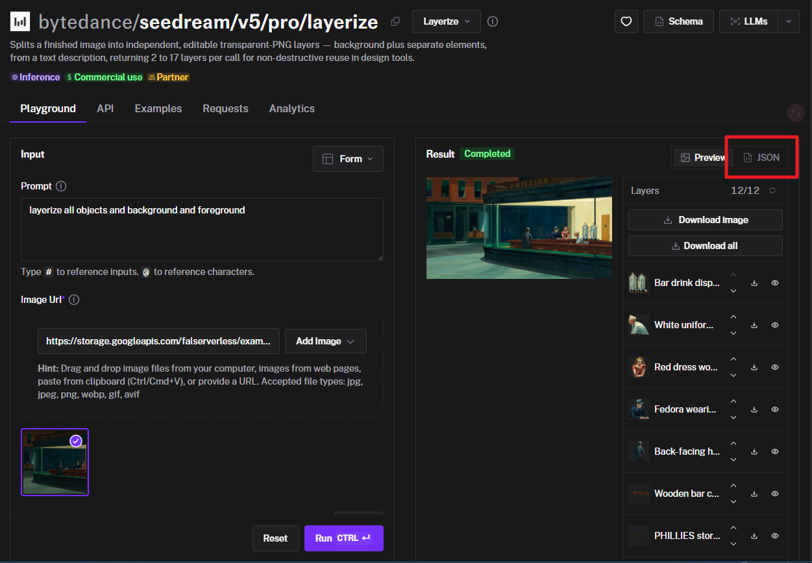
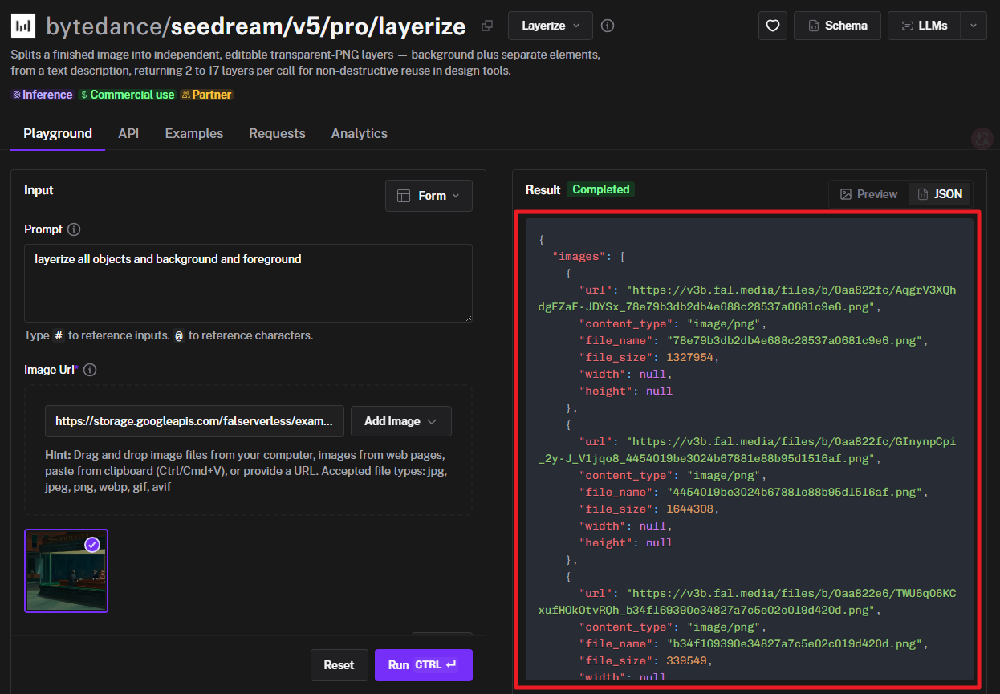
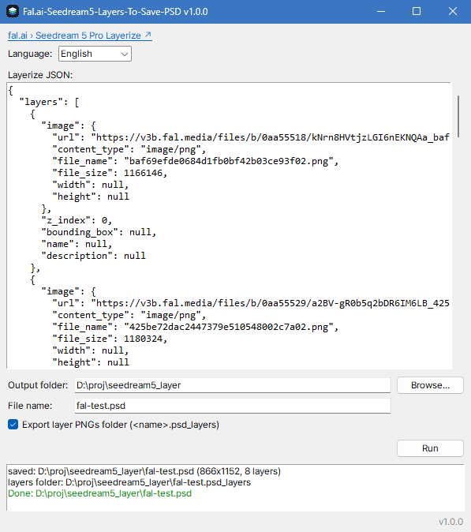

# Fal.ai-Seedream5-Layers-To-Save-PSD

*Read this in other languages: [한국어](README.ko.md)*

Saves a fal.ai [Seedream 5 Pro **Layerize**](https://fal.ai/models/bytedance/seedream/v5/pro/layerize) result as a PSD with **Embedded Smart Objects** — every AI-separated object layer is embedded at its original resolution as a true Smart Object, not a flattened raster. Runs on pure Python — no Photoshop installation required.

**⬇ Download:** grab the standalone Windows exe from the [latest release](https://github.com/coeyes/Fal.ai-Seedream5-Layers-To-Save-PSD/releases/latest) — no Python install needed.

## Overview

[Seedream 5 Pro Layerize](https://fal.ai/models/bytedance/seedream/v5/pro/layerize) decomposes a single image into per-object layers (transparent PNGs) using AI, and returns a JSON describing each layer's URL, name, and placement (bounding box). This tool takes that JSON and:

1. Downloads each layer PNG
2. Creates a PSD canvas sized to the `z_index=0` layer (the background; its name is `null`, so it becomes `background`)
3. Embeds each PNG **at its original high resolution as a Smart Object**, transform-placed at its bounding box, stacked in `z_index` order

The layer PNGs are roughly 2× higher resolution than their final placement size, so embedding them as Smart Objects means no quality loss when scaling or repositioning them later in Photoshop.

## Getting the JSON from fal.ai

1. Run [Seedream 5 Pro Layerize](https://fal.ai/models/bytedance/seedream/v5/pro/layerize) on the fal.ai playground.
2. When the Result shows **Completed**, switch the result view to **JSON** (red box below):

   

3. Copy the whole JSON — the panel has a copy button (red box below):

   

## GUI

```bat
python gui.py
```



Paste the copied JSON into the text area, pick the output folder and file name, then hit **Run**. Progress and results stream into the status log at the bottom. UI languages: English / 한국어 / 日本語 (auto-detected from the OS).

## CLI

```bat
.venv\Scripts\activate
python make_psd.py layer.json          @REM creates layer.psd + layer.psd_layers/
python make_psd.py layer.json -o my.psd
python make_psd.py layer.json --gen-layers-folder 0   @REM PSD only
```

The default output is `<json stem>.psd` (e.g. `layer.json` → `layer.psd`).

By default, each layer's original PNG is also saved to a `<output.psd>_layers` folder as `<zindex>_<layername>.png`. Characters invalid in filenames are replaced with `_`, and case-insensitive duplicates (including the reserved `background` name from z0) are disambiguated with `_2`, `_3`, ... suffixes.

## Install

```bat
uv venv --seed
.venv\Scripts\activate
uv pip install -r requirements.txt
```

Dependencies: `psd-tools`, `pillow` (tested on Python 3.12).

### Building a standalone exe

```bat
build.bat
```

Converts `icon.png` to a multi-size `.ico` and packages the GUI with PyInstaller into `dist\Fal.ai-Seedream5-Layers-To-Save-PSD.exe` (single file, no console).

## How it works (summary)

psd-tools does not officially support *creating* Smart Objects. This tool uses psd-tools' low-level serialization layer to assemble the Smart Object blocks (`SoLd`, `PlLd`, and the global `lnk2`) directly. The descriptor structures are embedded as base64 templates captured from binaries actually written by Photoshop, with only the UUIDs, transform, and sizes patched at runtime — which makes the approach robust.

It also works around a previously unreported psd-tools bug — the `contentID` descriptor at the tail of `LinkedLayer` v8 is dropped on write, which makes **Photoshop refuse to open the file entirely** — via a `LinkedLayerV8` subclass. See [TECH.md](TECH.md) for the format details, the template-patching strategy, and how the bug was tracked down.

## Verification

Opened the output in Photoshop 27.6: all 8 layers are recognized as `LayerKind.SMARTOBJECT`, and the PNG that Photoshop itself flatten-exports (`ps_export.png`) matches the expected thumbnail (`final_thumb.png`). The psd-tools re-parsing check lives in `_ref/verify.py`.

## Files

- `make_psd.py` — core / CLI script
- `gui.py` — tkinter GUI wrapper
- `layer.json` / `final_thumb.png` — test input / expected result
- `TECH.md` — technical write-up: the PSD Smart Object binary structure and the generation technique
- `CHANGELOG.md` — release history

## License / Author

MIT License — see [LICENSE](LICENSE).

Author: **Hyeongjik Song** <coeyes@gmail.com>
